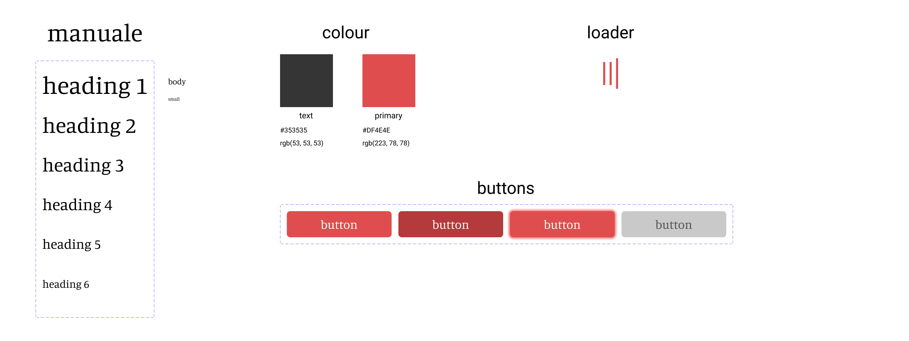

# lyrical - https://lyrical-web.netlify.app
A minimal lyric searching website with a focus on best performance, practices and accessibility.

## 🎨 Design System

Font - [Manuale](https://fonts.google.com/specimen/Manuale)

## 📚 Packages

- [Axios](https://github.com/axios/axios#axios)
- [Query String](https://github.com/sindresorhus/query-string#readme)
- [React](https://reactjs.org/)
- [React Hook Form](https://react-hook-form.com/)
- [React Query](https://react-query.tanstack.com/)
- [Snowpack](https://www.snowpack.dev/)
- [Styled Components](https://styled-components.com/)
- [TypeScript](https://www.typescriptlang.org/)
- [Wouter](https://github.com/molefrog/wouter#features)

## 🔦🏠 Lighthouse result

